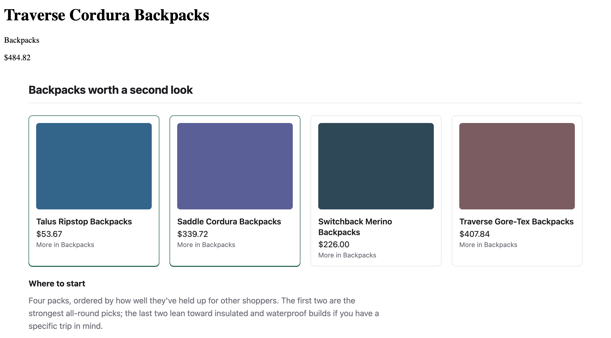

# rudra-js

Recommendation blocks designed by a language model, rendered on the server by React, with every
product fact read from your own catalog.

A model that writes HTML can put a price on the page that is not real. This one never writes HTML.
It returns a specification drawn from a closed vocabulary: a layout, a headline and the wording.
There is no field in it for a price, and none for a product name, an image or a link. Products are
named by SKU, and only from the list you sent. In the default mode the products in a grid or a
carousel are picked per request from that list, not by the model.



React Server Components turn that specification into markup, reading the title, price, image and
link from your catalog as the page is served. What the model wrote renders as escaped text.

The model's words are also read for prices, discounts, ratings, delivery dates and stock counts, and
text that makes one of those claims is dropped. That check reads words, so a careful rewording can
get past it. The structure is what holds. The model is never told a price, and the specification has
no field to put one in.

The block is in the first HTML response and ships no client JavaScript, so a crawler that does not
run JavaScript still reads it. On the 500-shopper benchmark the default mode makes 460 model calls
per 1,000 page views, against 1,000 when you generate for each shopper. Running with no model at all
is a supported setting rather than a stub, and it bills nothing.

> **Status: `0.1.0`, early.** Installable and usable. The Getting started below runs as a test on
> every commit. The public contracts may still change between minor versions before `1.0`, and the
> changelog says when they do.

## Getting started

Nothing here needs an API key. Leave the provider out and you get the deterministic
component — a supported setting, not a stub, and the right one until you have decided
on a model.

```sh
npm install @rudra-js/core @rudra-js/react zod@^4.5
```

Every package here lives under the `@rudra-js` scope. The unscoped `rudra-js` package on npm
belongs to someone else and has nothing to do with this project — check the `@` before you
install.

zod 4.5 or later is required. The public API of `@rudra-js/core` _is_ zod schemas, so your app and
the package have to resolve the same zod, and a zod 3 app will fail to install. The floor is 4.5
rather than 4.0 because 4.5 changed how a nullable field is written into the tool schema the model
is asked to fill in — `tests/tool-schema.test.ts` holds the golden copy of that schema.

Node 22.12 or later is required. Node 20 is end of life, and nothing here is built or tested on it.

```tsx
import { createComponentGenerator, parseTrackingInput } from '@rudra-js/core';
import { RudraComponent } from '@rudra-js/react';

const catalog = [
  { sku: 'A-1', title: 'Cast iron skillet', category: 'Cookware', price: 39, currency: 'USD' },
  { sku: 'A-2', title: 'Enamel dutch oven', category: 'Cookware', price: 89, currency: 'USD' },
  { sku: 'A-3', title: 'Chef knife', category: 'Knives', price: 55, currency: 'USD' },
];

async function recommendations() {
  // No provider means no API key and no spend. It is a supported setting, not
  // a stub: you get the deterministic component.
  const generator = createComponentGenerator({ provider: null });

  // Parsing fills in what you left out and rejects what does not belong. Pass
  // the parsed candidates to the renderer, not your raw objects.
  const input = parseTrackingInput({
    user: { id: 'shopper-1' },
    context: { surface: 'pdp', currentSku: 'A-1', currentCategory: 'Cookware' },
    candidates: catalog,
    signals: { cart: [{ sku: 'A-2', at: Date.now() }] },
  });

  const spec = await generator.generate(input);

  return <RudraComponent spec={spec} products={input.candidates} />;
}
```

In Next.js, `export default recommendations` at the end makes this a page. A shopper
looking at the skillet with the dutch oven already in their cart is shown the knife,
under the heading "Goes with your cart". The page they are on and the thing they
have already chosen are both left out. No model was asked, and nothing was billed.

To bring a model in, add [`@rudra-js/anthropic`](packages/anthropic) and pass it as the
`provider`. Everything above stays the same — the model writes the wording, the layout and
the emphasis, and by default the products in a grid or carousel are still chosen here
rather than by the model. See [What the model decides, by
mode](packages/core#what-the-model-decides-by-mode) for the line in each mode,
[`@rudra-js/core`](packages/core) for the full payload, and
[`@rudra-js/react`](packages/react) for the class names to style.

That adapter is one option, not the only one. The three-method interface any model can sit
behind is in [Any provider](packages/core#any-provider).

The code above is run as a test on every commit, so a change that breaks it fails CI.

## Packages

| Package                                     | What it does                                                                                       |
| ------------------------------------------- | -------------------------------------------------------------------------------------------------- |
| [`@rudra-js/core`](packages/core)           | The contracts and logic that turn one tracking payload into one renderable component specification |
| [`@rudra-js/react`](packages/react)         | Renders that specification as React Server Components, with no client JavaScript                   |
| [`@rudra-js/anthropic`](packages/anthropic) | Talks to the Anthropic API, and is the only package that makes a billed call                       |

## Development

Node `>=22.12` is required. Node 20 is end of life, and
`npm run verify:consumer` runs TypeScript through `--experimental-strip-types`,
which 20.19 does not have. `.nvmrc` names an exact 22, and `engine-strict=true` turns a
mismatch into a readable install error. CI runs the checks on 22.12.0 as well as
on the `.nvmrc` version, so the floor is exercised rather than just declared.

```sh
nvm use
npm install

npm run check        # all six of the below, in order

npm run build        # tsc -b across the workspace
npm run typecheck    # includes test files, which the build does not
npm run lint
npm run format:check
npm test
npm run verify:consumer   # packs all three packages and uses them from outside the repo
```

`ANTHROPIC_API_KEY= RUDRA_REPLAY_ONLY=1 npm run bench` measures what each generation mode costs under a stub model; [bench/README.md](bench/README.md) says what its columns mean.

If you have a key in your shell, run the tests as `ANTHROPIC_API_KEY= npm test`. `vitest.config.ts`
sets `RUDRA_REPLAY_ONLY=1` for every test run, and the shop throws at start-up when that is set and
a key is set too — so a run with a key in the shell fails to load instead of calling the model.

CI runs all six of these on every pull request as separate steps, so a failure names itself, and a
second job builds the example shop and checks that its page still reads as one to a crawler. CI sets
no mode, so the shop replays and that job runs the build plainly:

```sh
npm run build --workspace @rudra-js/example-shop
npm run verify:crawlable
```

Locally that build is safe on its own — a key alone no longer spends anything, only
`RUDRA_SHOP_MODE=record` does. The prefix makes it a rule rather than a default:

```sh
ANTHROPIC_API_KEY= RUDRA_REPLAY_ONLY=1 npm run build --workspace @rudra-js/example-shop
```

## Example

[`examples/shop`](examples/shop) is a small Next.js storefront that puts the architecture through a
real page: a product page asks a language model for a recommendation component and server-renders
the result into the same HTML response, rather than fetching it after the page loads.

```sh
npm run dev --workspace @rudra-js/example-shop
# then visit http://localhost:3000/product/RJ-00001?shopper=S-0001
```

That replays the transcripts committed under `examples/shop/recordings/`, so it bills nothing
whatever keys are in your environment. `RUDRA_SHOP_MODE` is the switch, and `record` is the one
value that spends money:

```sh
RUDRA_SHOP_MODE=record npm run dev --workspace @rudra-js/example-shop
```

That calls Claude once for each page with no transcript yet and saves the answer as a new one. Pages
that already have a transcript are still replayed, so browsing costs nothing after the first time.

[`examples/shop/README.md`](examples/shop/README.md) covers the rest: the environment variables, how
to re-record a transcript after a prompt change, and why the files under `recordings/` must only
ever hold demo shoppers and demo catalogs.

## Getting help

- **Questions and ideas** — open a [discussion](https://github.com/clivedsouza1010/rudra-js/discussions).
- **Bugs** — open an [issue](https://github.com/clivedsouza1010/rudra-js/issues/new/choose).
- **Vulnerabilities** — please report privately, see [SECURITY.md](./SECURITY.md).

## Contributing

Contributions are welcome. [CONTRIBUTING.md](./CONTRIBUTING.md) covers setup, the scope the project
holds to, and its naming and testing conventions. Everyone taking part is expected to follow the
[code of conduct](./CODE_OF_CONDUCT.md).

Changes are recorded in the [changelog](./CHANGELOG.md).

## Licence

[MIT](./LICENSE) © Clive Dsouza
